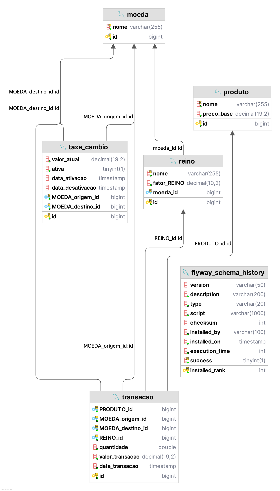

# Wefin API

## Descrição

A **Wefin API** é uma aplicação desenvolvida em **Spring Boot** para gerenciar conversões de produtos entre moedas e reinos.

---

## Funcionalidades Principais

1. **Conversão de Produtos**
    - Realiza a conversão de um produto com base na quantidade, taxa de câmbio e fator do reino.

2. **Gerenciamento de Taxas de Câmbio**
    - Consulta da **taxa ativa** entre moedas de origem e destino.
    - Ativação de **novas taxas** de câmbio.
    - Histórico de taxas com filtros opcionais.

3. **Documentação com Swagger UI**
    - Documentação interativa dos endpoints através do **SpringDoc OpenAPI**.

---

## Tecnologias Utilizadas

- **Java 17**
- **Spring Boot 3.x**
- **Spring Data JPA**
- **MySQL**
- **FlyWay**
- **Hibernate**
- **SpringDoc OpenAPI**
- **Lombok**
- **Maven**

---

### Documentação

http://localhost:8080/swagger-ui/index.html#/

## Script das Tabelas

> ⚠️ **Observação**: O **Flyway** foi incluído no projeto. Caso utilize a mesma configuração do banco de dados (**MySQL 8.4**, esquema **`wefin`**), as tabelas serão criadas automaticamente, junto com uma carga inicial de dados.

### Estrutura do Banco de Dados

```sql
CREATE TABLE wefin.produto (
    id BIGINT AUTO_INCREMENT PRIMARY KEY,
    nome VARCHAR(255) NOT NULL UNIQUE,
    preco_base DECIMAL(19,2) NOT NULL
);

CREATE TABLE wefin.moeda (
    id BIGINT AUTO_INCREMENT PRIMARY KEY,
    nome VARCHAR(255) NOT NULL UNIQUE
);

CREATE TABLE wefin.reino (
    id BIGINT AUTO_INCREMENT PRIMARY KEY,
    nome VARCHAR(255) NOT NULL UNIQUE,
    fator_reino DECIMAL(10,2) NOT NULL
);

CREATE TABLE wefin.taxa_cambio (
    id BIGINT AUTO_INCREMENT PRIMARY KEY,
    valor_atual DECIMAL(19,2) NOT NULL,
    ativa BOOLEAN NOT NULL,
    data_ativacao TIMESTAMP NULL,
    data_desativacao TIMESTAMP NULL,
    moeda_origem_id BIGINT NOT NULL,
    moeda_destino_id BIGINT NOT NULL,
    FOREIGN KEY (moeda_origem_id) REFERENCES moeda(id),
    FOREIGN KEY (moeda_destino_id) REFERENCES moeda(id)
);

CREATE TABLE wefin.transacao (
    id BIGINT AUTO_INCREMENT PRIMARY KEY,
    produto_id BIGINT NOT NULL,
    moeda_origem_id BIGINT NOT NULL,
    moeda_destino_id BIGINT NOT NULL,
    reino_id BIGINT NOT NULL,
    quantidade DOUBLE NOT NULL,
    valor_transacao DECIMAL(19,2) NOT NULL,
    data_transacao TIMESTAMP NOT NULL,
    FOREIGN KEY (produto_id) REFERENCES produto(id),
    FOREIGN KEY (moeda_origem_id) REFERENCES moeda(id),
    FOREIGN KEY (moeda_destino_id) REFERENCES moeda(id),
    FOREIGN KEY (reino_id) REFERENCES reino(id)
);

-- Produtos
INSERT INTO wefin.produto (nome, preco_base) VALUES ('Hidromel', 25.50);
INSERT INTO wefin.produto (nome, preco_base) VALUES ('Madeira', 150.75);
INSERT INTO wefin.produto (nome, preco_base) VALUES ('Pele', 350.00);

-- Reinos
INSERT INTO wefin.reino (nome, fator_reino) VALUES ('Wefin', 1.15);
INSERT INTO wefin.reino (nome, fator_reino) VALUES ('Anões', 1.30);

-- Moedas
INSERT INTO wefin.moeda (nome) VALUES ('Ouro Real');
INSERT INTO wefin.moeda (nome) VALUES ('Tibar');

-- Taxas de Câmbio
INSERT INTO wefin.taxa_cambio (valor_atual, ativa, data_ativacao, moeda_origem_id, moeda_destino_id)
VALUES (2.5, true, NOW(),
        (SELECT id FROM wefin.moeda WHERE nome = 'Ouro Real'),
        (SELECT id FROM wefin.moeda WHERE nome = 'Tibar'));

INSERT INTO wefin.taxa_cambio (valor_atual, ativa, data_ativacao, moeda_origem_id, moeda_destino_id)
VALUES (0.4, true, NOW(),
        (SELECT id FROM wefin.moeda WHERE nome = 'Tibar'),
        (SELECT id FROM wefin.moeda WHERE nome = 'Ouro Real'));

ALTER TABLE wefin.reino
ADD COLUMN moeda_id BIGINT;

ALTER TABLE wefin.reino
ADD CONSTRAINT fk_reino_moeda
FOREIGN KEY (moeda_id) REFERENCES wefin.moeda(id);

UPDATE wefin.reino
SET moeda_id = 1
WHERE id = 1;

UPDATE wefin.reino
SET moeda_id = 2
WHERE id = 2;
```

### Modelo de dados


